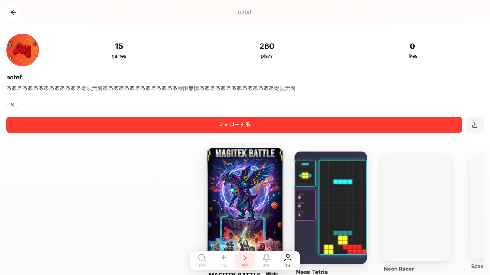
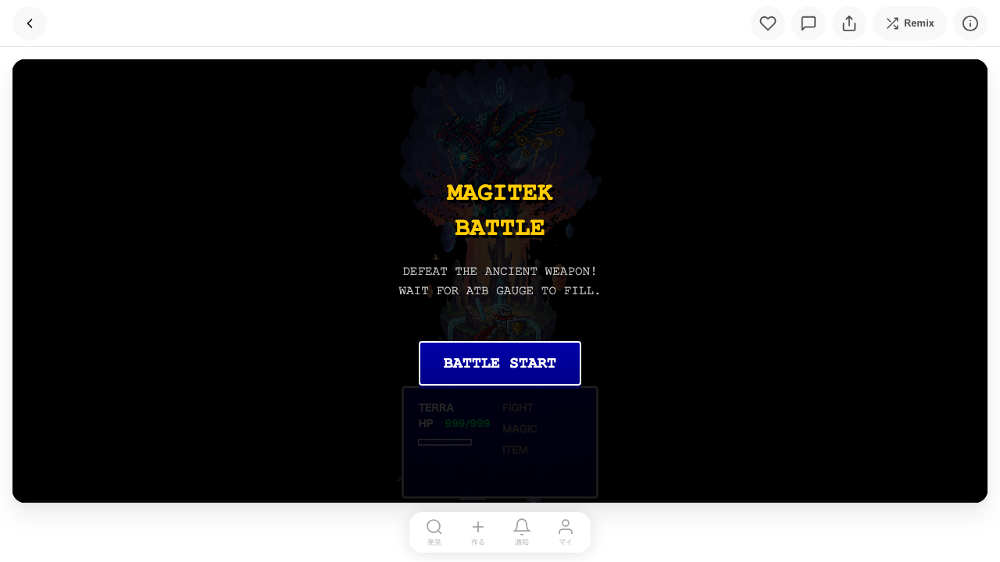
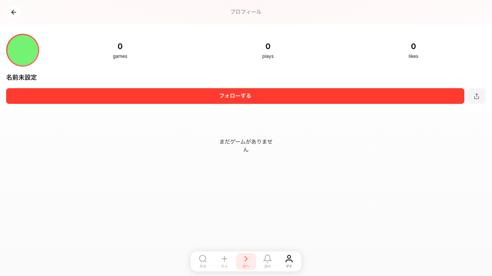

# Unified Profile Page Browser Test Report

**Date:** 2026-02-04
**Tester:** Claude (agent-browser)
**Target:** https://v2.dreamcore.gg

## Test Results Summary

| Test Case | Status | Notes |
|-----------|--------|-------|
| Public profile page (logged out) | PASS | Profile info, stats, games carousel displayed correctly |
| Game click navigation | PASS | Navigates to `/game/{public_id}?from=profile` |
| Profile with no games | PASS | "まだゲームがありません" message displayed |
| UUID to public_id redirect | PASS | UUID correctly redirected to public_id URL |

## Test Details

### 1. Public Profile Page (Logged Out)

**URL:** `https://v2.dreamcore.gg/u/u_Wga8teQNyk`

**Verified Elements:**
- Profile avatar displayed (red game controller icon)
- Username: "notef"
- Bio text displayed
- Stats: 15 games, 260 plays, 0 likes
- X (Twitter) social link button
- "フォローする" (Follow) button - red, prominent
- Share button (upload icon)
- Games carousel with multiple game cards
- Back button in header
- Bottom navigation bar

**Screenshot:**

---

### 2. Game Click Navigation

**Action:** Clicked on "MAGITEK BATTLE" game card

**Result:**
- Successfully navigated to `/game/g_ty7Tca641a?from=profile`
- Game page loaded with:
  - Game title and start screen
  - Back button for navigation
  - Like, comment, share buttons
  - "Remix" button
  - Info button
  - Game is playable

**Screenshot:**

---

### 3. Profile with No Games

**URL:** `https://v2.dreamcore.gg/u/u_dwRJDeSoG2`

**Verified Elements:**
- Default avatar (solid green circle)
- Username: "名前未設定" (Name not set)
- Stats: 0 games, 0 plays, 0 likes
- "フォローする" (Follow) button
- Empty state message: "まだゲームがありません" (No games yet)
- No game carousel displayed

**Screenshot:**

---

### 4. UUID to public_id Redirect

**Input URL:** `https://v2.dreamcore.gg/u/ed58dfd0-03c8-4617-ae86-f28df6f562ff`

**Result:**
- URL automatically redirected to: `https://v2.dreamcore.gg/u/u_Wga8teQNyk`
- Same profile page as test #1 displayed
- Plays counter increased to 263 (from playing the game in test #2)

**Screenshot:**

---

## Issues Found

**None** - All tests passed successfully.

## Implementation Notes

1. **Game card click handling**: The click events are attached via JavaScript (`addEventListener`), not HTML `onclick` attributes or `<a>` tags. This works correctly but may not be discoverable by simple link crawlers.

2. **Play count tracking**: The plays counter increased from 260 to 263 between tests, indicating that the play tracking is working in real-time.

3. **Title handling**:
   - Profile with username shows username in header (e.g., "notef")
   - Profile without username shows "プロフィール" in header

4. **Social links**: X (Twitter) button is shown when the user has a linked account.

## Files Created

- `.claude/logs/profile-page-notef.png` - Profile page for notef
- `.claude/logs/profile-game-click.png` - Game page after click
- `.claude/logs/profile-no-games.png` - Profile with no games
- `.claude/logs/profile-uuid-redirect.png` - Profile after UUID redirect
